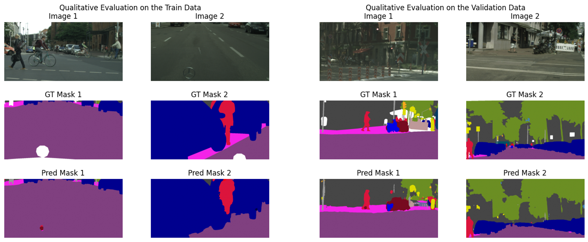

# **Semantic Segmentation of Road Dataset for Autonomous Driving**
## **Introduction**

This repository presents the code developed for my mini-project completed as part of the "TDT17 - Visual Intelligence" course during the second year of my master's program at NTNU, Trondheim. Alongside the code, a presentation slide deck is provided, encapsulating a concise overview of the experiments conducted.

This repository presents the code developed for my mini-project as part of the "TDT17 - Visual Intelligence" course during the second year of my master's program at [**NTNU, Trondheim**](https://ntnu.no/). Alongside the code, a presentation slide deck is provided, encapsulating a concise overview of the experiments conducted.

## **Qualitative Results**

## **Project Reproduction Instructions**
To use this code for similar experiments, kindly follow the steps below
- Clone the repository 
- Run `conda create --name cityscapes python=3.8 pip -y && conda activate cityscapes` 
- Run `pip install -r requirements.txt` to install the required packages.
- Edit the training configuration in `scripts/train.sh`
- Execute `scripts/train.sh` to train the model
- Get your model weights and tensorboard event file in the output directory set in `scripts/train.sh`.